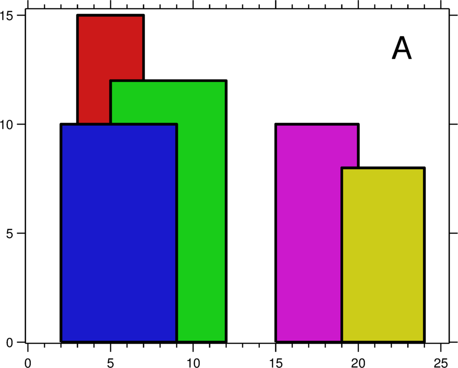
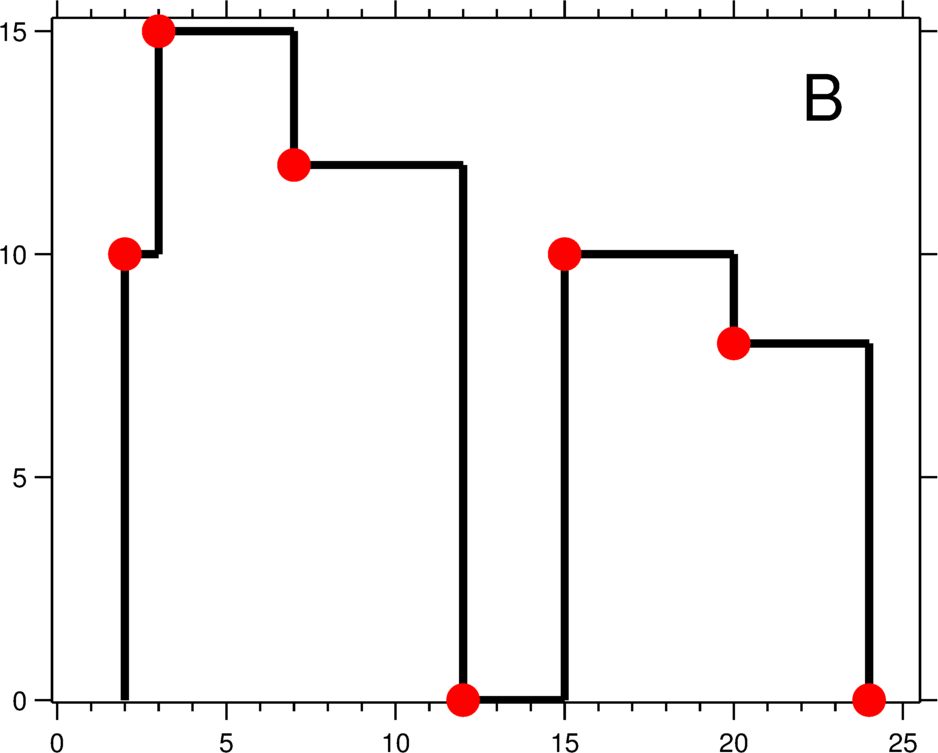

# 218. The Skyline Problem
A city's skyline is the outer contour of the silhouette formed by all the buildings in that city when viewed from a distance. Now suppose you are given the locations and height of all the buildings as shown on a cityscape photo (Figure A), write a program to output the skyline formed by these buildings collectively (Figure B).



The geometric information of each building is represented by a triplet of integers [Li, Ri, Hi], where Li and Ri are the x coordinates of the left and right edge of the ith building, respectively, and Hi is its height. It is guaranteed that 0 ≤ Li, Ri ≤ INT_MAX, 0 < Hi ≤ INT_MAX, and Ri - Li > 0. You may assume all buildings are perfect rectangles grounded on an absolutely flat surface at height 0.

For instance, the dimensions of all buildings in Figure A are recorded as: [ [2 9 10], [3 7 15], [5 12 12], [15 20 10], [19 24 8] ] .

The output is a list of "key points" (red dots in Figure B) in the format of [ [x1,y1], [x2, y2], [x3, y3], ... ] that uniquely defines a skyline. A key point is the left endpoint of a horizontal line segment. Note that the last key point, where the rightmost building ends, is merely used to mark the termination of the skyline, and always has zero height. Also, the ground in between any two adjacent buildings should be considered part of the skyline contour.

For instance, the skyline in Figure B should be represented as:[ [2 10], [3 15], [7 12], [12 0], [15 10], [20 8], [24, 0] ].

Notes:

The number of buildings in any input list is guaranteed to be in the range [0, 10000].
The input list is already sorted in ascending order by the left x position Li.
The output list must be sorted by the x position.
There must be no consecutive horizontal lines of equal height in the output skyline. For instance, [...[2 3], [4 5], [7 5], [11 5], [12 7]...] is not acceptable; the three lines of height 5 should be merged into one in the final output as such: [...[2 3], [4 5], [12 7], ...]

```cpp
#include <algorithm>
#include <cmath>
#include <deque>
#include <iostream>
#include <iterator>
#include <list>
#include <math.h>       /* log2 */
#include <random>
#include <set>
#include <map>
#include <sstream>
#include <string>
#include <unordered_map>
#include <unordered_set>
#include <vector>

#define SKELETON

#ifdef SKELETON 
#define _MIN_S_32 0x80000001
#define _MIN_U_32 0x00000000
#define _MAX_S_32 0x7fffffff
#define _MAX_U_32 0xffffffff
#endif

#ifndef MMIN
#define MMIN(x,y) ((x) > (y) ? (y) : (x))
#endif
#ifndef MMAX
#define MMAX(x,y) ((x) < (y) ? (y) : (x))
#endif

#ifndef PRINT1D
#define PRINT1D(v,d) do {for (auto it_print : v) cout << it_print << d; cout << endl;}while(0)
#endif

#ifdef PRINT1D
#ifndef PRINT2D
#define PRINT2D(v,d)                          \
do {                                          \
    cout << endl;                             \
    for (auto &it_print2d : v) {              \
        for (auto &it_print1d : it_print2d) { \
            cout << it_print1d << d;          \
            } cout << endl;                   \
    }                                         \
} while(0)
#endif
#endif

#ifndef MDebugLog
#define MDebugLog(msg)  std::cout << __FILE__ << ":" << __LINE__ << ": " << msg
#endif

/* using */

using std::cin;
using std::cout;
using std::deque;
using std::endl;
using std::getline;
using std::list;
using std::multiset;
using std::pair;
using std::set;
using std::sqrt;
using std::string;
using std::stringstream;
using std::unordered_map;
using std::unordered_set;
using std::multimap;
using std::vector;

/* typedef */

typedef vector<int> vint;
typedef vector<vector<int>> vvint;
typedef vector<vvint> vvvint;
typedef vector<vvvint> vvvvint;

/* example */
/*
 * vector<int> mvec;
 * mvec.begin(); mvec.end(); pair<int, int>; first; second;
 * iterator
 * while(getline(stringstream, string, char))
 */
class Solution {
public:
        typedef pair<int, int> pint;
        enum STAT{LET = 0, RIT = 1, HIT = 2, IDX = 3};
        struct lessV{
                bool operator() (const vint &l, const vint &r) {
                        return l[0] < r[0];
                }
        };
        struct lessH
        {
                bool operator() (const vint &l, const vint &r) {
                        return l[1] < r[1];
                }
        };
        static bool cmb_vint(const vint &lhs, const vint &rhs)
        {
                if (lhs[0] != rhs[0])
                        return lhs[0] < rhs[0];
                return lhs[2] > rhs[2];
        }
        bool isIn(const vint &cur, const vint &pre)
        {
                return cur[LET] >= pre[LET] && cur[RIT] <= pre[RIT] && cur[HIT] <= pre[HIT];

        }
        void clean(vvint &bu)
        {
                if (bu.empty()) return;
                std::sort( bu.begin(), bu.end(), cmb_vint);
                vvint res;
                res.push_back(bu.front());
                for (int i = 1; i < bu.size(); ++i)
                {
                        if (!isIn(bu[i], res.back()))
                                res.push_back(bu[i]);
                }
                bu = res;
        }
        vector<pair<int, int>> getSkyline(vector<vector<int>>& buildings) {
                vector<pint> res;
                if (buildings.empty()) return res;
                clean(buildings);
                for (int i = 0; i < buildings.size(); ++i) { buildings[i].push_back(i);}
                multiset<vint, lessV> vset;
                multiset<vint, lessH> hset;
                for (auto & it : buildings)
                {
                        vint v1 = {it[LET], it[HIT], 2*it[IDX]}, v2 = {it[RIT], it[HIT], 2*it[IDX]+1};
                        vset.insert(v1); vset.insert(v2); hset.insert(v1); hset.insert(v2);
                }
                vvint candidates;

                vint idxs(buildings.size()*2, 1);

                for (auto &it : buildings) {
                        isKept(vset, hset, it, idxs);
                }
                return help(idxs, buildings);
        }
        vector<pint> help(vint &idxs, vvint &bu)
        {
                int n = bu.size();
                vvint candidates;
                vvint tmps;
                for (int i = 0; i < n; ++i)
                {
                        auto &b = bu[i];
                        int idx0 = i * 2, idx1 = i * 2 + 1;
                        if (idxs[idx0] == 1) candidates.push_back({b[LET], b[HIT], idx0});
                        if (idxs[idx1] == 1) candidates.push_back({b[RIT], b[HIT], idx1});
                }

                set<vint, lessV> mod_set;

                for (int i = 0; i < candidates.size(); ++i)
                {
                        auto &cand = candidates[i];
                        int idx = cand[2];
                        if (idx % 2 == 0) tmps.push_back({cand[0], cand[1]});
                        else {
                                tmps.push_back({cand[0], 0});
                                int t0 = tmps.size() - 1;
                                mod_set.insert({cand[0], 0, cand[2], t0/* record */});
                        }
                }
                /*modify*/
                for (int i = 0; i < n; ++i)
                {
                        auto & b = bu[i];
                        int l = b[LET], r = b[RIT], h = b[HIT];
                        vint eleL = {l,h,0}, eleR = {r,h,0};
                        auto lo = mod_set.lower_bound(eleL), up = mod_set.upper_bound(eleR);
                        for (auto it = lo; it != up; ++it) {
                                auto &itv = *it;
                                if (itv[2] / 2 == i) continue;
                                if (tmps[itv[3]][1] < h) tmps[itv[3]][1] = h;
                        }
                }
                tmps.back()[1] = 0;
                std::sort(tmps.begin(), tmps.end(), [](const vint&l, const vint&r){return l[0] < r[0];});
                vector<pint> res;
                for (auto it : tmps) res.push_back(std::make_pair(it[0], it[1]));
                return res;
        }
        void isKept(multiset<vint, lessV> &vset, multiset<vint, lessH> &hset, vint &v, vint &idxs)
        {
                int h = v[HIT], l = v[LET], r = v[RIT], idx = v[IDX];
                vint eleL = {l, h, idx*2}, eleR = {r, h, idx*2+1}, ele0 = {0, 0, 0};
                auto hdel_up = hset.upper_bound(eleL),
                     hdel_lo = hset.lower_bound(ele0);
                auto vdel_up = vset.upper_bound(eleR),
                     vdel_lo = vset.lower_bound(eleL);
                unordered_set<int> mset0, mset1;
                for (auto it = hdel_lo; it != hdel_up; ++it) {
                        auto &t0 = *it;
                        int i0 = t0[2];
                        if (i0/2 != idx && idxs[i0] == 1) mset0.insert(i0);
                }
                for (auto it = vdel_lo; it != vdel_up; ++it) {
                        auto &t0 = *it;
                        int i0 = t0[2];
                        if (i0/2 != idx && idxs[i0] == 1) mset1.insert(i0);
                }
                for (auto it : mset0) {
                        if (mset1.find(it) != mset1.end()) {
                                idxs[it] = 0;
                        }
                }
        }
};
```
