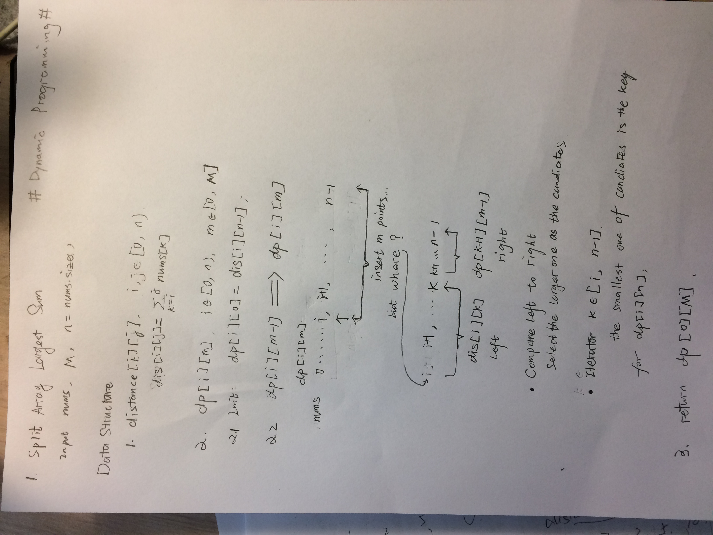

# 410. Split Array Largest Sum
Given an array which consists of non-negative integers and an integer m, you can split the array into m non-empty continuous subarrays. Write an algorithm to minimize the largest sum among these m subarrays.
## Examples:
> Input:
> nums = [7,2,5,10,8]
> m = 2
>
> Output:
> 18
>
> Explanation:
> There are four ways to split nums into two subarrays.
> The best way is to split it into [7,2,5] and [10,8],
> where the largest sum among the two subarrays is only 18.

_______________


## solution




```cpp
#include <iostream>
#include <vector>
#include <string>
#include <random>
#include <algorithm>
#include <iterator>
#include <unordered_map>
#include <unordered_set>
#include <math.h>       /* log2 */

#ifndef MMIN
#define MMIN(x,y) ((x) > (y) ? (y) : (x))
#endif
#ifndef MMAX
#define MMAX(x,y) ((x) < (y) ? (y) : (x))
#endif

#ifndef PRINT1D
#define PRINT1D(v,d) do {for (auto it_print : v) cout << it_print << d; cout << endl;}while(0)
#endif

#ifdef PRINT1D
#ifndef PRINT2D
#define PRINT2D(v,d)                          \
do {                                          \
    cout << endl;                             \
    for (auto &it_print2d : v) {              \
        for (auto &it_print1d : it_print2d) { \
            cout << it_print1d << d;          \
            } cout << endl;                   \
    }                                         \
} while(0)
#endif
#endif

#ifndef MDebugLog
#define MDebugLog(msg)  std::cout << __FILE__ << ":" << __LINE__ << ": " << msg
#endif

/* Usings */

using std::cout;
using std::cin;
using std::endl;

using std::unordered_map;
using std::unordered_set;
using std::string;
using std::vector;
using std::pair;

/* Typedef */

typedef vector<int> vint;
typedef vector<vector<int>> vvint;
typedef vector<vvint> vvvint;
typedef vector<vvvint> vvvvint;


class Solution {
public:
    void distance(vint &nums){
        dp_dis.clear();
        int n = nums.size();
        dp_dis.resize(n, vint(n, 0));
        if (nums.empty()) return;
        for (int i = 0; i < n; ++i) {
            dp_dis[i][i] = nums[i];
        }
        for (int i = 1; i < n; ++i) {
            for (int j = 0; j < n-i; ++j) {
                dp_dis[j+i][j] = dp_dis[j][j+i] = dp_dis[j][j+i-1] + nums[j+i];
            }
        }
        return;
    }

    int splitArray(vector<int>& nums, int m) {
        return iter_helper(nums, m);
    }
    int iter_helper(vint &nums, int m) {
        if (m == nums.size()) {
            int res = nums[0];
            for (int num : nums)
                res = MMAX(res, num);
            return res;
        }

        distance(nums);
        int n = nums.size();
        vint dp0(n, 0);
        auto dp1 = dp0;
        for (int i = 0; i < n; ++i) {
            dp0[i] = dp_dis[i][n-1];
        }
        int max_sum = dp_dis[0][n-1];
        for (int i = 1; i < m; ++i) {
            for (int j = 0; j <= n-1-i; ++j){// dp1
                dp1[j] = max_sum;
                for (int k = j; k <= n-1-i; ++k){
                    int l = dp_dis[j][k],
                        r = dp0[k+1];
                    int mmax = MMAX(l, r);
                    if (dp1[j] > mmax) {
                        dp1[j] = mmax;
                    }
                    if (l >= r) { break; }
                }
            }// dp1
            dp0 = dp1;
        }
        return dp0[0];
    }
    // private data
private:
    vvint dp_dis;
};
```
