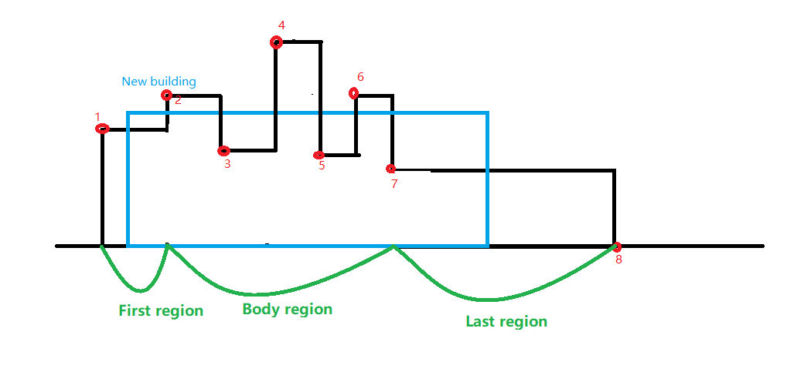

# Problem
A city's skyline is the outer contour of the silhouette formed by all the buildings in that city when viewed from a distance. Now suppose you are given the locations and height of all the buildings as shown on a cityscape photo (Figure A), write a program to output the skyline formed by these buildings collectively (Figure B).


The geometric information of each building is represented by a triplet of integers [Li, Ri, Hi], where Li and Ri are the x coordinates of the left and right edge of the ith building, respectively, and Hi is its height. It is guaranteed that 0 ≤ Li, Ri ≤ INT_MAX, 0 < Hi ≤ INT_MAX, and Ri - Li > 0. You may assume all buildings are perfect rectangles grounded on an absolutely flat surface at height 0.

For instance, the dimensions of all buildings in Figure A are recorded as: [ [2 9 10], [3 7 15], [5 12 12], [15 20 10], [19 24 8] ] .

The output is a list of "key points" (red dots in Figure B) in the format of [ [x1,y1], [x2, y2], [x3, y3], ... ] that uniquely defines a skyline. A key point is the left endpoint of a horizontal line segment. Note that the last key point, where the rightmost building ends, is merely used to mark the termination of the skyline, and always has zero height. Also, the ground in between any two adjacent buildings should be considered part of the skyline contour.

For instance, the skyline in Figure B should be represented as:[ [2 10], [3 15], [7 12], [12 0], [15 10], [20 8], [24, 0] ].


# Solution

We have two data structures for this problem.

**head**: It is a sorted list, containing the horizontal position of contour of the buildings. E.g. for the figure 2, head = [2,3,7,12,15,20,24]. It is mantained as sorted list so that we can apply binary-search using Python lib ***bisect*** function. It is also used to define/find logarithmically the position of new buiding in the skyline contour.

**lrh**: Dictionary data. It stores the end position and hight value of *contour line* for each point in head.

We define the concept *contour line* as basic unit of skyline contour.

## Get the answer **iteratively**

Here is the basic idea: for the new building (bule one in the below figure) that is to be merged into the skylines, the update steps are divided into three parts:

- First region. There are two cases.If the hight of new building is larger than the one of the first contour line, then the contour line must be changed. The *head* and *lrh* data structure must be updated according.

- Body region. This part is easy to understand. If the hight of contour line is enlarged by the new buidling, only *lrh* is updated.

- Last region. Same with the First region.




## Code
```python
import sys
import bisect
INT_MAX = sys.maxsize
class Solution:
    def getSkyline(self, buildings):
        if not buildings:
            return []
        if len(buildings) == 1:
            return [buildings[0][0:3:2], [buildings[0][1], 0]]
        
        # init
        lrh = dict()
        lrh[buildings[0][0]] = buildings[0][1:3]
        lrh[buildings[0][1]] = [INT_MAX, 0]
        head = [buildings[0][0], buildings[0][1]]

        for i in range(1, len(buildings)):
            b = buildings[i]
            left = b[0]
            right = b[1]
            hight = b[2]
            lo = bisect.bisect_left(head, left)
            if lo >= len(head) or head[lo] != left:
                lo -= 1
            hi = bisect.bisect_left(head, right)
            if hi >= len(head) or head[hi] != right:
                hi -= 1

            firstIndex = head[lo]
            lastIndex = head[hi]
            firstRight = lrh[head[lo]][0]
            firstHight = lrh[head[lo]][1]
            lastRight = lrh[head[hi]][0]
            lastHight = lrh[head[hi]][1]
            # __---__
            if lo == hi:
                if firstHight < hight:
                    lrh[right] = [firstRight, firstHight]
                    lrh[firstIndex] = [left,firstHight]
                    lrh[left] = [right, hight]
                    bisect.insort_left(head, left)
                    bisect.insort_left(head, right)
            else:
                jIndex = [head[j] for j in range(lo+1, hi)]
                # first
                if firstHight < hight and left < firstRight:
                    if firstIndex == left:
                        lrh[firstIndex] = [firstRight, hight]
                    else:
                        lrh[firstIndex] = [left,firstHight]
                        lrh[left] = [firstRight, hight]
                        bisect.insort_left(head, left)
                # last
                
                if lastHight < hight and lastIndex != right:
                    bisect.insort_left(head, right)
                    lrh[right] = [lastRight, lastHight]
                    lrh[lastIndex] = [right, hight]
                # lo+1 -- hi
                for j in jIndex:
                    bj = lrh[j]
                    if bj[1] < hight:
                        lrh[j] = [bj[0], hight]
        # concatenate
        pos_hight = [[k, lrh[k][1]] for k in lrh]
        key_points = []
        pos_hight.sort()
        for ph in pos_hight:
            if not key_points:
                key_points.append(ph)
            else:
                if key_points[-1][1] != ph[1]:
                    key_points.append(ph)
        
        return key_points
```